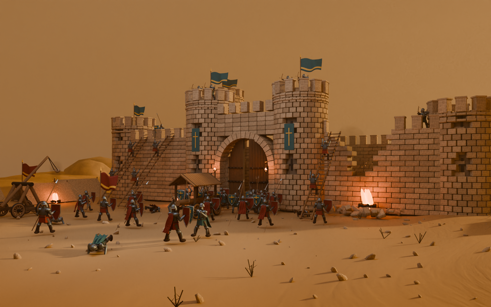

# Blender Desert Scenes

Two desert-themed still scenes built entirely with Blender Python scripting — all geometry, materials, lighting and cameras are generated by code, so every image here is reproducible from the scripts in this repository.

两个完全由 Blender Python 程序化搭建的沙漠题材静帧场景。几何、材质、灯光、相机全部由脚本生成，仓库里的每一张图都能用脚本重新跑出来。

| 场景 | 内容 | 渲染规格 |
| --- | --- | --- |
| [Tiger I · 突尼斯沙漠 1943](./tiger-i-desert-1943/) | 虎式坦克，交错负重轮、独立履带链接、风化沙漠涂装、真实沙漠全景背景 | 3200 × 2000，Cycles 96 spp |
| [Qasr al-Raml · 沙垒：最后的琥珀光](./qasr-al-raml-siege/) | 中世纪沙漠城堡攻防战，双塔拱门、攻城梯、冲车、投石车、50 名士兵 | 1920 × 1200，Cycles GPU |

---

## 截图

### Tiger I · 突尼斯沙漠 1943


### Qasr al-Raml · 沙垒：最后的琥珀光



---

## 环境

- Blender 5.2.1 LTS
- 渲染器 Cycles，AgX 色彩管理
- 坦克场景用 OptiX GPU 渲染，无可用设备时回退 CPU；攻城场景默认 GPU

## 目录结构

```
blender-desert-scenes/
├── tiger-i-desert-1943/
│   ├── README.md
│   ├── renders/          # 成品渲染图
│   └── scripts/          # 场景生成 → 细化 → 打磨 → 渲染 全流程脚本
└── qasr-al-raml-siege/
    ├── README.md
    ├── preview_hd.png    # 成品渲染图
    ├── scene_report.json # 实际生成统计
    └── *.py              # 场景生成脚本
```

## 说明

两个场景都是原创的程序化几何重建，不是扫描件或现成模型拼接。坦克是参考北非战场早期虎式坦克的艺术性复原，不是逐尺寸校核的博物馆级复刻，车体战术编号为虚构。攻城场景中的人物为分部件静态摆姿模型，适合整体战场镜头，未做蒙皮绑定与动作动画。

坦克场景用到 Poly Haven 的 CC0 素材（植被、岩石与 HDR 环境），来源与授权清单见 [`tiger-i-desert-1943/assets/SOURCES.md`](./tiger-i-desert-1943/assets/SOURCES.md)。攻城场景未使用任何外部模型、图片纹理或品牌元素。
