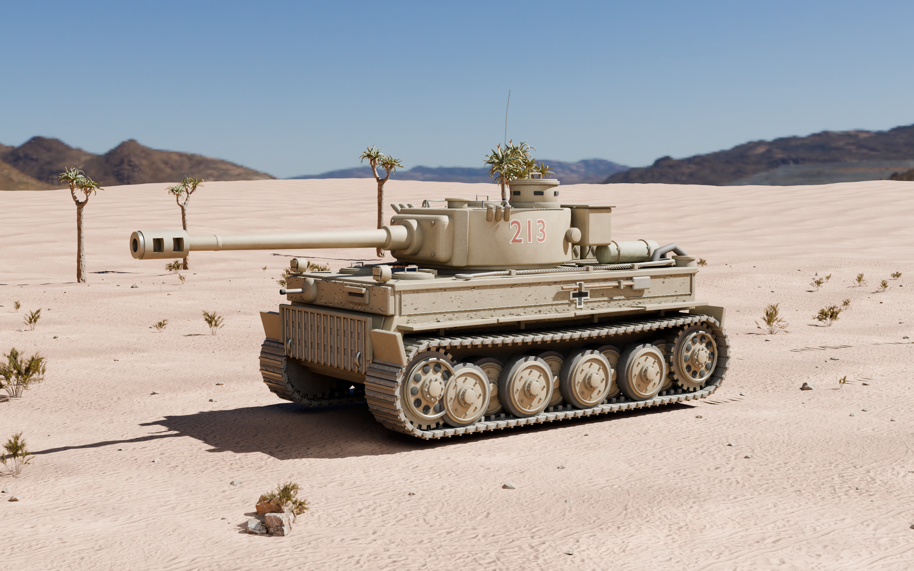
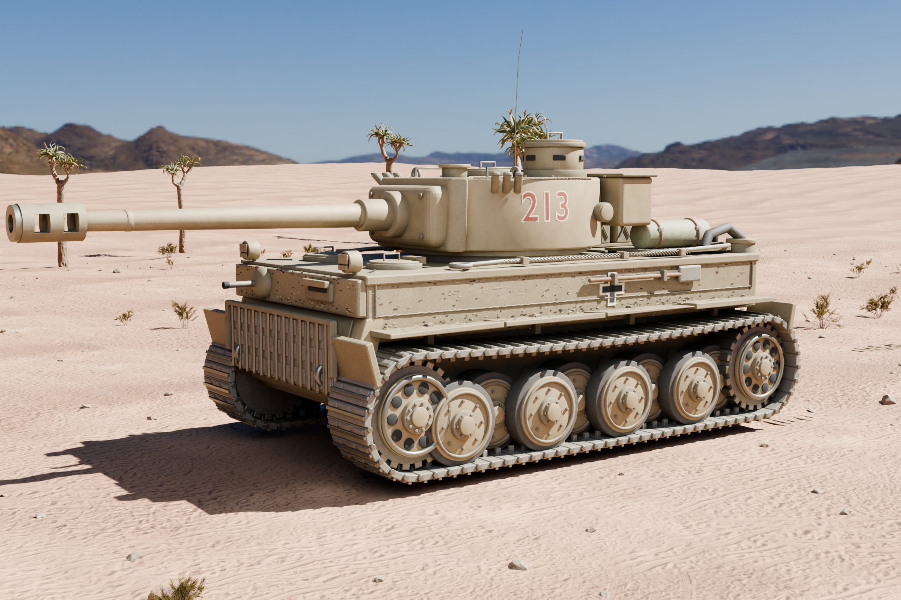
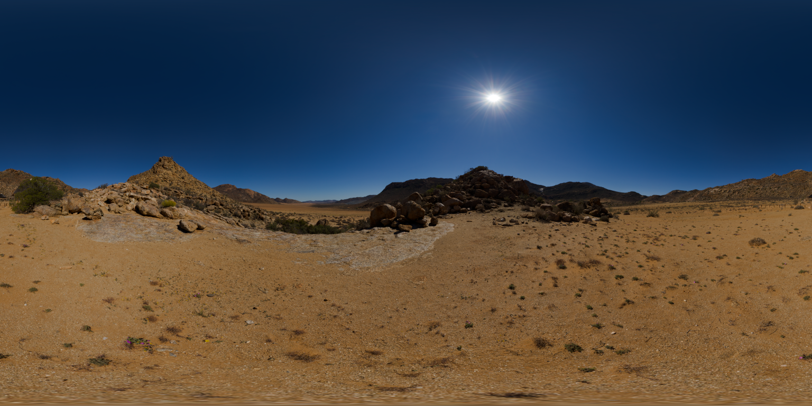

# Tiger I · Tunisian desert, 1943

An early Tiger I in North Africa, rebuilt procedurally in Blender. Editable geometry, individual track links, interleaved road wheels, weathered desert paint, modelled desert terrain and physically based daylight.

The vehicle is an artistic reconstruction inspired by an early Tiger I in North Africa, not a dimension-certified museum replica. The tactical number is fictional.

## Renders








## 场景统计

来自 `verification.json` 的实测数据：

- Blender 版本：5.2.1 LTS
- 对象总数：2452，其中网格对象 2370
- 独立履带链接：158 节
- 材质：25
- 打包贴图：17 张（含 4K HDR 环境贴图与照片级 PBR 沙地贴图）
- 最终相机：hero three-quarter
- 渲染：Cycles，96 spp，3200 × 2000

## 生成流程

脚本按顺序执行即可复现最终效果。每一步都在上一步的场景文件上继续，最后一个脚本跑完直接渲染。

| 顺序 | 脚本 | 作用 |
| --- | --- | --- |
| 1 | `build_scene.py` | 车体、炮塔、火炮、交错负重轮、158 节独立履带、地形与道具的程序化生成 |
| 2 | `refine_scene.py` | 地形细化与场景组织 |
| 3 | `finalize_scene.py` | 风化、材质与细节收尾 |
| 4 | `polish_lighting.py` | 灯光打磨 |
| 5 | `realism_pass.py` | 植被、花岗岩、金属件与日照的写实化修订 |
| 6 | `finish_photography.py` | 接地、真实全景背景与摄影级曝光 |
| 7 | `render_scene.py` | 渲染入口 |

辅助脚本：`verify_scene.py` 输出场景校验统计（即上面的 `verification.json`），`inspect_assets.py` 检查外部素材，`panorama_preview.py` 生成全景预览。

## 使用

用 Blender 打开工程文件，小键盘 `0` 进入主相机，`Z` 切到 Material Preview 查看材质，`F12` 渲染当前相机。

```powershell
& 'C:\Program Files\Blender Foundation\Blender 5.2\blender.exe' --background --factory-startup --python '.\scripts\build_scene.py'
```

## 素材来源

外部素材全部来自 Poly Haven，授权 CC0：

- Quiver Tree 01：https://polyhaven.com/a/quiver_tree_01
- Wild Rooibos Bush：https://polyhaven.com/a/wild_rooibos_bush
- Namaqualand Boulder 02：https://polyhaven.com/a/namaqualand_boulder_02
- Goegap（4K HDR 环境）：https://polyhaven.com/a/goegap
- Dry Cracked Lake（4K HDR，开发阶段照明）：https://polyhaven.com/a/dry_cracked_lake
- Aerial Sand（2K 照片级 PBR 贴图）：https://polyhaven.com/a/aerial_sand

贴图与 HDR 环境已打包进工程文件，便于迁移。完整清单见 [`assets/SOURCES.md`](./assets/SOURCES.md)。

最终相机看到的是真实 Goegap 沙漠全景作为背景，配合自建地形、树木、灌木与岩石。这是艺术化合成场景，不是战时实拍照片。载具、道具、履带压痕与前景地形均为 `build_scene.py` 生成的原创建模。
